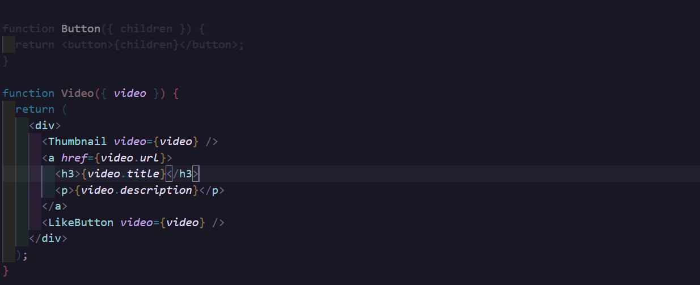
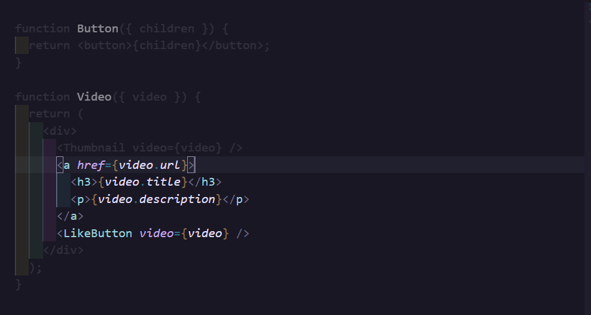

# limelight README

This is the README for your extension "limelight". After writing up a brief description, we recommend including the following sections.

## Features

Focus on the code you want to see and nothing else.

- Block Focus

- Custom Selection Focus

## Extension Settings

- `limelight.opacity` (default: 0.1): Opacity of the dimmed code
- `limelight.lightThemeColor` (default: rgb(0, 0, 0)): Color of the dimmed code in light theme (CSS color format)
- `limelight.darkThemeColor` (default: rgb(255, 255, 255)): Color of the dimmed code in dark theme (CSS color format)
- `limelight.persistOnTabSwitch` (default: true): Whether to persist the limelight effect when switching to other files/tabs

## Release Notes

### 0.0.1

Initial release of the Limelight extension.
    - Block Focus
    - Selection Focus

---
